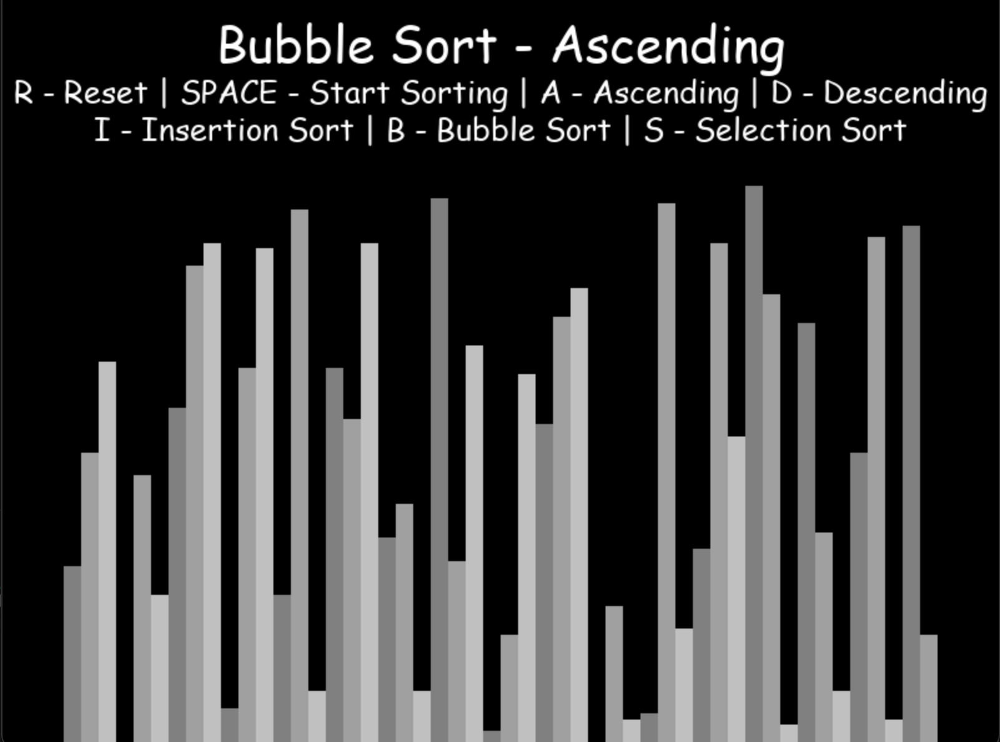
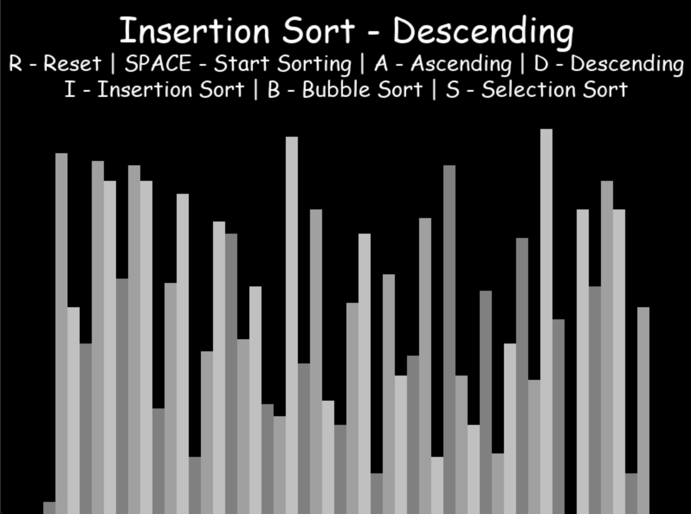
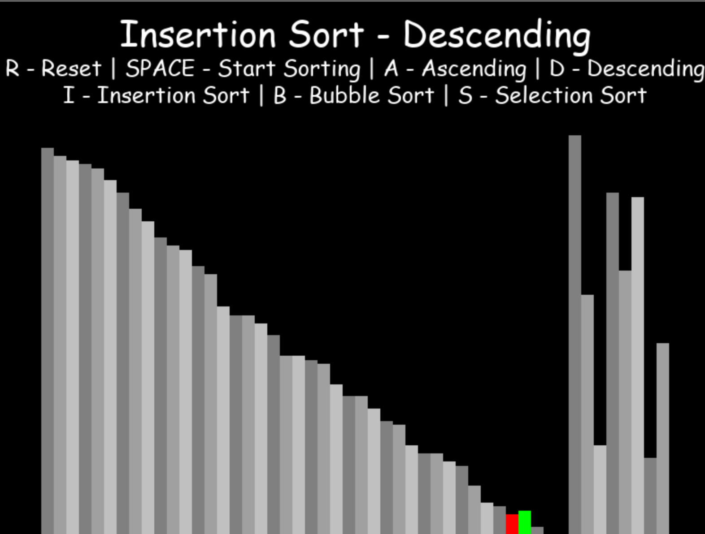
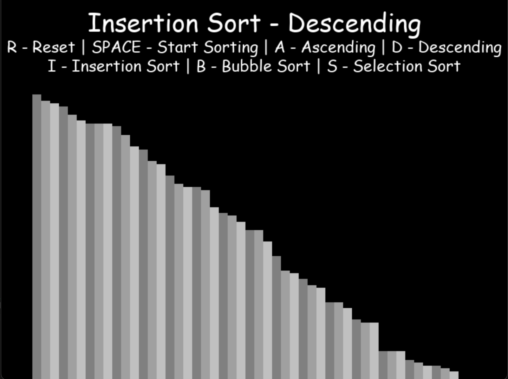

# Sorting Visualiser
Basic app built using `Python Pygame` module, which shows how n^2 algorithms sort arrays.  
We can choose between 3 sorting algorithms such as:  
* Insertion Sort  
* Bubble Sort  
* Selection Sort 

  
### We can also change between **ascending** and **descending** order.

### Example below represents how algorithm works for **insertion sort descending**.

